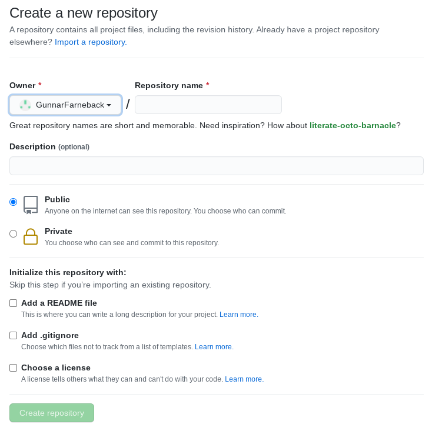

# Creating a Registry at GitHub

This tutorial shows how to create your own registry for Julia packages
with
[LocalRegistry](https://github.com/GunnarFarneback/LocalRegistry.jl)
and make it publically available in a GitHub repository.

LocalRegistry has no special support or preference for GitHub and
works equally well with other git hosting services. You can use this
tutorial with other git hosting services but you need to adapt the
GitHub interactions yourself. If you want a tutorial tailored for your
favorite git hosting service, feel free to submit a pull request that
adds it.

## Versions

This tutorial was made in June 2021 using Julia 1.6.1, Git 2.20.1 and
LocalRegistry 0.4.0. The tutorial was made on Linux but should work
the same on other platforms. Paths may look different though.

## Prerequisites

It is assumed that you have Julia and Git installed on your computer
and a GitHub account where you can create a new repository for your
registry. You also need to be able to authenticate with Git to GitHub
using either `https` with password or `ssh` with keys. Some
familiarity with Git and with GitHub is assumed.

## Preparations

First you need to install LocalRegistry. Start Julia and press `]` to
enter Julia's package mode (prompt changes to `(@v1.6) pkg>` and then
do `add LocalRegistry`:

```
(@v1.6) pkg> add LocalRegistry
   Resolving package versions...
    Updating `~/.julia/environments/v1.6/Project.toml`
  [89398ba2] + LocalRegistry v0.4.0
    Updating `~/.julia/environments/v1.6/Manifest.toml`
  [15f4f7f2] + AutoHashEquals v0.2.0
  [89398ba2] + LocalRegistry v0.4.0
  [d1eb7eb1] + RegistryTools v1.5.6
  [0dad84c5] + ArgTools
  [56f22d72] + Artifacts
  [2a0f44e3] + Base64
  [ade2ca70] + Dates
  [f43a241f] + Downloads
  [b77e0a4c] + InteractiveUtils
  [b27032c2] + LibCURL
  [76f85450] + LibGit2
  [8f399da3] + Libdl
  [56ddb016] + Logging
  [d6f4376e] + Markdown
  [ca575930] + NetworkOptions
  [44cfe95a] + Pkg
  [de0858da] + Printf
  [3fa0cd96] + REPL
  [9a3f8284] + Random
  [ea8e919c] + SHA
  [9e88b42a] + Serialization
  [6462fe0b] + Sockets
  [fa267f1f] + TOML
  [a4e569a6] + Tar
  [cf7118a7] + UUIDs
  [4ec0a83e] + Unicode
  [deac9b47] + LibCURL_jll
  [29816b5a] + LibSSH2_jll
  [c8ffd9c3] + MbedTLS_jll
  [14a3606d] + MozillaCACerts_jll
  [83775a58] + Zlib_jll
  [8e850ede] + nghttp2_jll
  [3f19e933] + p7zip_jll
```

We can check that it has been installed with the `status` command:

```
(@v1.6) pkg> status
      Status `~/.julia/environments/v1.6/Project.toml`
  [89398ba2] LocalRegistry v0.4.0
```

Hit Backspace to exit the package made and get back to a normal
`julia>` prompt. In the rest of this tutorial switches to and from
package mode will only be indicated by the prompt.

Notice that we have installed LocalRegistry in the global Julia
environment. This is normal for development tools and makes them
available from the REPL also when you have activated a package
environment. Unless you are actually using LocalRegistry within a
package you should never make LocalRegistry a dependency of any
package you want to register.

## Creating a Remote Repository on GitHub

Although it is possible to create and use a registry that only exists
in one particular Julia installation, the normal use case is that you
want to share it; either with other people or just with yourself on
multiple computers. In order to do so you need to have a remote git
repository which you and, if desired, other people can connect to to
get access to your registry.

This tutorial shows how to create the remote repository on GitHub.
Start a web browser and go to the start page of your GitHub account.
In my case the URL is `https://github.com/GunnarFarneback`. Replace
the account name with your own. Near the top of the page you should
have a bar with some tab names:


Click on `Repositories`,


and then on `New`.

This takes you to a new page:



Fill in whatever name you like in the `Repository name` box. I will
call this registry `DemoRegistry` and use the same name for the
repository. Having the same name is practical but not required. Fill
in something in `Description` if you want. Choose `Public` or
`Private` based on the visibility you want to have. Do *not* tick any
of the initialization boxes.


Click on `Create repository` to get it created. This will pop up a new page:


Do *not* follow any of these instructions; LocalRegistry will take
care of setting it up. For now just take note of the repository URL at
the top of the page. Depending on how you authenticate to GitHub you
may want to use the `https` URL instead of the `ssh` URL. In that
case, click on the `HTTPS` box near the top to switch to showing the
`https` URL:


## Creating the Registry

Now we are ready to create the new registry but let us first have a
look at the installed registries:

```
(@v1.6) pkg> registry status
Registry Status
 [23338594] General (https://github.com/JuliaRegistries/General.git)
```

This only lists the General registry. After this tutorial is finished
it will be complemented by our new registry.

Load LocalRegistry:
```
julia> using LocalRegistry
```

We can get online help using the help mode; press `?` to enter and
type `LocalRegistry`:

```
help?> LocalRegistry
search: LocalRegistry

  LocalRegistry
  ≡≡≡≡≡≡≡≡≡≡≡≡≡≡≡

  Create and maintain local registries for Julia packages. This package is intended to
  provide a simple but manual workflow for maintaining small local registries (private or
  public) without making any assumptions about how the registry or the packages are
  hosted.

  Registry creation is done by the function create_registry.

  Registration of new and updated packages is done by the function register.
```

We want to run `create_registry`, and can again use help mode for
documentation:

```
help?> create_registry
search: create_registry

  create_registry(name, repo)
  create_registry(path, repo)

  Create a registry with the given name or at the local directory path, and with
  repository URL repo. The first argument is interpreted as a path if it has more than
  one path component and otherwise as a name. If a path is given, the last path component
  is used as the name of the registry. If a name is given, it is created in the standard
  registry location. In both cases the registry path must not previously exist.

  Keyword arguments

  create_registry(...; description = nothing, push = false, gitconfig = Dict())

    •  description: Optional description of the purpose of the registry.

    •  push: If false, the registry will only be prepared locally. Review the result
       and git push it manually.

    •  gitconfig: Optional configuration parameters for the git command.
```

Here we will use the name `DemoRegistry`, the remote repository
`git` URL we noted in the previous section and also fill in a
`description` and set `push` to `true` to avoid needing to do anything
manually with `git`:

```
julia> create_registry("DemoRegistry", "git@github.com:GunnarFarneback/DemoRegistry.git", description = "Demo registry for LocalRegistry tutorial.", push = true)
Enumerating objects: 3, done.
Counting objects: 100% (3/3), done.
Delta compression using up to 16 threads
Compressing objects: 100% (2/2), done.
Writing objects: 100% (3/3), 383 bytes | 383.00 KiB/s, done.
Total 3 (delta 0), reused 0 (delta 0)
Transferred: sent 2952, received 2796 bytes, in 2.2 seconds
Bytes per second: sent 1366.4, received 1294.2
To github.com:GunnarFarneback/DemoRegistry.git
 * [new branch]      master -> master
Branch 'master' set up to track remote branch 'master' from 'origin'.
[ Info: Created registry in directory /home/gunnar/.julia/registries/DemoRegistry
"/home/gunnar/.julia/registries/DemoRegistry"
```

This has created the new registry, pushed it to GitHub and added it to
the available registries for this Julia installation as can be seen with
```
(@v1.6) pkg> registry status
Registry Status
 [38554413] DemoRegistry (git@github.com:GunnarFarneback/DemoRegistry.git)
 [23338594] General (https://github.com/JuliaRegistries/General.git)
```

Going back to the browser at GitHub, refreshing the page now shows the
first commit in the registry, which has created a single file.


Clicking on `Registry.toml` shows the content of the freshly created
registry.


We can see the name, the repo address, and the description we entered,
and a unique id that LocalRegistry has created. The `[packages]`
section is empty since no packages have been added to the registry
yet.

If you want to add a readme or a license file you can do so directly
with Git. The functionality of the registry will not be impacted by
additional files at the top level of the repository.

## Troubleshooting

If something goes wrong here it is probably related to authentication.
You need to find out from GitHub's documentation how to get that
working. In this process it may be easier to use `push = false` in the
call to `create_registry` and get the authentication and pushing to
the remote repository done outside of Julia using your favorite Git
client.

## Adding the Registry to Another Julia Installation

To share this registry with someone else, or with another computer of
yours, tell them to add your registry by the repository URL. When
sharing a public repository with someone else you would usually use
the `https` URL, since that is sufficient for read only access without
authentication.

```
(@v1.6) pkg> registry status
Registry Status
 [23338594] General (https://github.com/JuliaRegistries/General.git)

(@v1.6) pkg> registry add https://github.com/GunnarFarneback/DemoRegistry.git
     Cloning registry from "https://github.com/GunnarFarneback/DemoRegistry.git"
       Added registry `DemoRegistry` to `/tmp/testdepot/registries/DemoRegistry`

(@v1.6) pkg> registry status
Registry Status
 [38554413] DemoRegistry (git@github.com:GunnarFarneback/DemoRegistry.git)
 [23338594] General (https://github.com/JuliaRegistries/General.git)
```

## Next Steps

There is not much value in an empty registry. Future tutorials will
show how to create a minimal public package and how to add it to this
registry.
